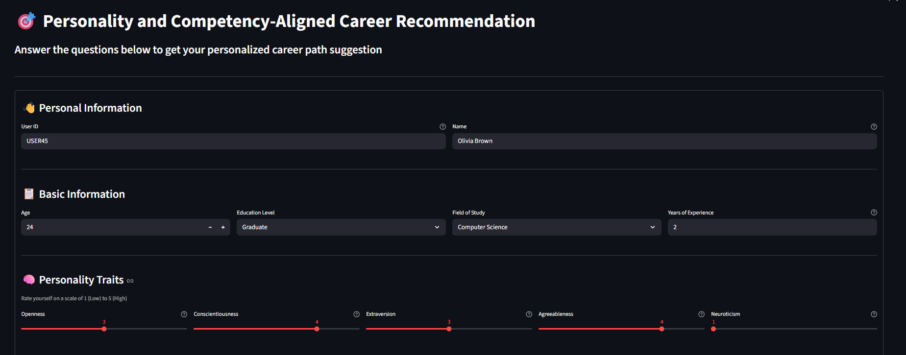
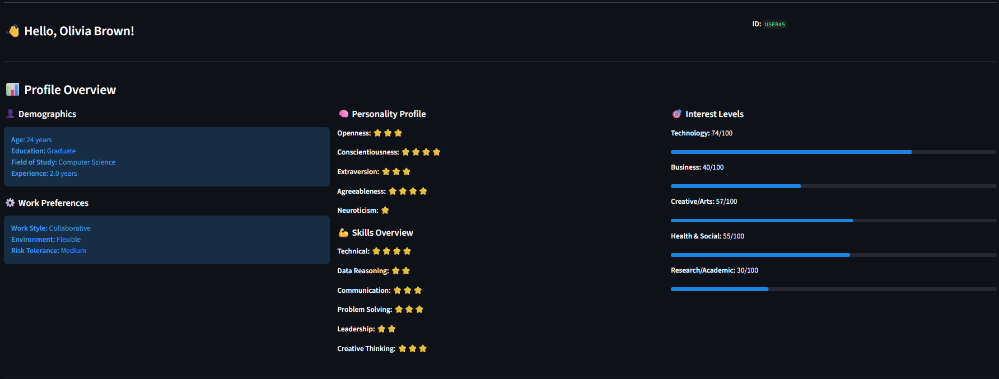
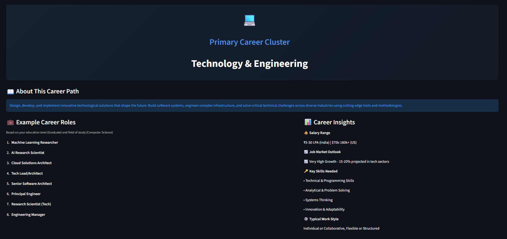
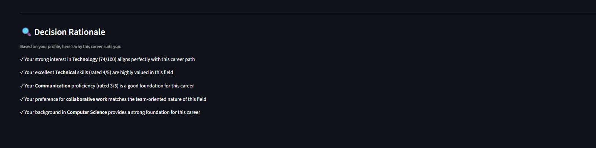

# Personality and Competency-Aligned Career Recommendation

A career recommendation engine using Machine Learning to match individuals with suitable career clusters based on comprehensive personality, skill, and interest assessments.

## What Decision Does This System Support?
This system supports **career path selection and planning decisions** by helping individuals:
1. **Identify suitable career clusters** aligned with their personality and competencies
2. **Explore career options** they may not have considered based on their profile
3. **Make informed career transitions** by understanding which fields match their strengths

## Target Users
This system is designed for students, graduates, and career counselors or advisors to support data-driven career guidance based on personality, skills, and interests.


## Dataset

- **Size**: 7000+ records
- **Features**: 23+ attributes including personality traits, skills, interests, work preferences
- **Target**: 7 career clusters
- **Source**: Synthetically generated to reflect realistic distributions of personality traits, skills, and career outcomes


## Tech Stack

- **Frontend**: Streamlit
- **ML Model**: Random Forest Classifier (Scikit-learn)
- **Data Processing**: Pandas, NumPy
- **Visualization**: Matplotlib, Seaborn
- **Model Serialization**: Joblib


## Features

- **Personalized Recommendations**: Based on Big Five personality traits, skills, and interests
- **7 Career Clusters**: Technology, Healthcare, Business, Design, Education, Finance, Entrepreneurship
- **Interactive UI**: Built with Streamlit for easy user interaction
- **Role Suggestions**: Lists specific job roles based on education and field of study


## Model Details

- **Algorithm**: Random Forest Classifier
- **Accuracy**: 84.27% (Test Set)
- **Features**: 40+ engineered features
- **Classes**: 7 career clusters


##  Project Structure
```
├── images/                   # UI screenshots
├── app.py                    # Streamlit application
├── career.ipynb              # Model training notebook
├── career.csv                # Training dataset
├── *.joblib                  # Model artifacts
├── requirements.txt          # Dependencies
└── README.md                 # Documentation
```


## Screenshots

<p align="center">
  
</p>

<p align="center">
  
</p>

<p align="center">
  
</p>

<p align="center">
  
</p>

<p align="center">
  
</p>


